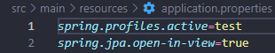
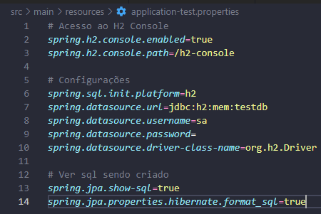
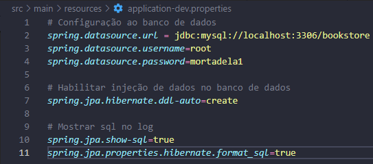
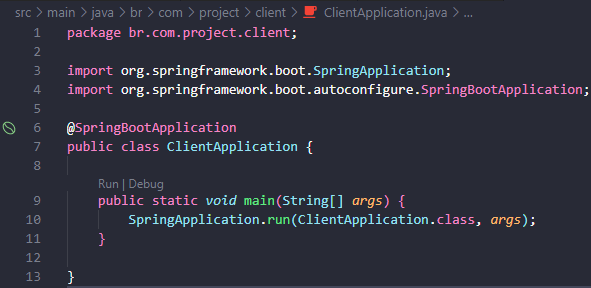
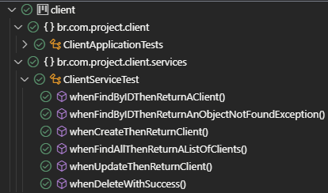

# Book Store Api

## Descrição do Projeto

Projeto consiste na criação de uma api para cadastro, atualização, remoção e gerenciamento de clientes em determinadas empresas.

Projeto retirado do canal [Ralf Lima](https://www.youtube.com/playlist?list=PLWXw8Gu52TRLR24HGjSiVrE5MrkU5tWX-).

## End-Points do Projeto

- [GET] consultar todos os clientes: {url}/client

- [GET] consultar 1 cliente especifico, passar id por parametro na requisição: {url}/client/{clientId}

- [POST] criar cliente: {url}/client/create
``` Json Body
{
    "name": "type string",
    "age": "type integer",
    "city": "type string",
}
```

- [Put] atualizar cliente, passar id do client por parametro da requisição: {url}/client/update/{id}
``` Json Body
{
    "name": "type string",
    "age": "type integer",
    "city": "type string",
}
```

- [DELETE] deletar client, passar id do client por parametro da requisição: {url}/client/delete/{id}

## Descrição da Api
### Executar Api localmente:
- Para clonar o projeto: git clone https://github.com/TaylanTorres09/client-api.git
- Para Executar o projeto precisasse:
    - Java [JDK](https://www.oracle.com/java/technologies/downloads/#java17). Este projeto está usando a versão 17.
    - Para perfil de Teste, Banco [H2](https://www.h2database.com/html/main.html) utilizado em memória, coloquei neste pois é um banco de fácil configuração e utilização.
    - Para perfil de Produção, Banco [MySQL](https://www.mysql.com/products/workbench/).

- Extensões do vscode utilizadas:
    - [Debugger for Java](https://marketplace.visualstudio.com/items?itemName=redhat.java)
    - [Spring Boot Extension Pack](https://marketplace.visualstudio.com/items?itemName=Pivotal.vscode-boot-dev-pack)

- Para seleção do perfil **test** para perfil de teste e **dev** para perfil de desenvolvimento.


- Configuração do banco de dados de Teste.



- Configuração do banco de dados de Dev.



- Na pasta src/main, execute o arquivo ClientApplication.java



- Testes realizados na aplicação.



- Para testar a api você pode utilizar ferramentas de client como:
    - [Postman](https://www.postman.com/)
    - [Insomnia](https://insomnia.rest/download)
    - Extensão do VsCode [Thunder Client](https://marketplace.visualstudio.com/items?itemName=rangav.vscode-thunder-client)
    - Ou outra de sua preferência.

## Próximos Passos
- Fazer interfaces no front-end.
## Autor
<a href="https://www.linkedin.com/in/taylan-torres" target="_blank"></a> 